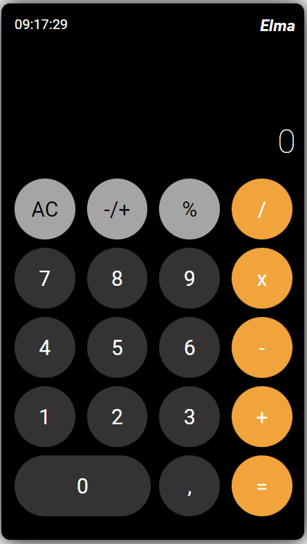

# Calculator App



## About

This application is a simple calculator application.
The backend side sends the 2 values received from the frontend side to site [Dneonline](http://www.dneonline.com/calculator.asmx) with the SOAP protocol and transmits the returned value back to the frontend side

## Setup - Calculator Server

- Install of required packages

```bash
    yarn install

    # or

    npm install
```

- Run project

```bash
    yarn start

    # or

    npm start
```

- Open application with `/calculator-client/index.html`
