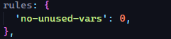
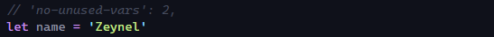
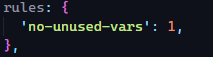
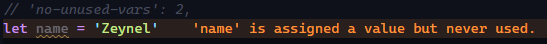
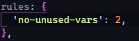
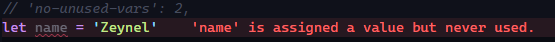

# ESLint

## İçerik

- [Nedir?](#nedir)
- [Kurulum](#kurulum)
- [Kullanma](#kullanma)
- [Örnek Uygulama](#uygulama)

## Nedir?


[Web sitesinde](https://eslint.org/) de yazdığı gibi **Javascript kodumuzdaki hataları bulmamıza ve onları düzeltmemize** yardımcı olan bir araçtır. Ayrıca birden fazla geliştirici tarafında geliştirilen uygulamalarda ortak yazım kuralı belirlenmesinde yardımcı olur. String'lerde `"` yerine `'` kullanılsın, kod sonunda `;` konulsun gibi genel kod yazım kuralı belirleyebiliriz.

## Kurulum

> **Gereksinim**: NodeJS `^12.22.0`, `^14.17.0`, veya `>=16.0.0` sürümlerinden birisi yüklü olmalıdır.

**1. NPM veya Yarn ile ESLint'in projeye dahil edilmesi.**

```bash
npm install eslint --save-dev

# veya

yarn add eslint --dev
```

**2. ESLint konfigürasyon dosyasının oluşturulması.**

```bash
npm init @eslint/config

# veya

yarn create @eslint/config
```

İşlem sırasında ESLint konfigürasyonu için bazı sorular sorulmaktadır:

1.  **How would you like to use ESLint?**
    - To check syntax only
    - **_To check syntax and find problems_**
    - To check syntax, find problems, and enforce code style
2.  **What type of modules does your project use?**
    - **_JavaScript modules (import/export)_**
    - CommonJS (require/exports)
    - None of these
3.  **Which framework does your project use?**
    - React
    - Vue.js
    - **_None of these_**
4.  **Does your project use TypeScript?**
    - **_No_**
    - Yes
5.  **Where does your code run?**
    - **_Browser_**
    - **_Node_**
6.  **What format do you want your config file to be in?**
    - **_JavaScript_**
    - YAML
    - JSON

> **Not**: Koyu ve italik olarak işaretlenen seçenekler mevcut repoda ki proje için seçilmiş seçeneklerdir. 5. soruda <kbd>Space</kbd> ile iki seçenekte seçilebilir.

**3. package.json içerisinde lint'i kullanabilmek için script tanımlayabiliriz.**

```json
"scripts": {
   "lint": "eslint *.js"
}
```

`*` yerine sadece lint'i çalıştırmak istediğiniz dosyayıda yazabilirsiniz ve ardından

```bash
npm run lint

# veya

yarn lint
```

komutlarıyla projemizde ESLint'i çalıştırabiliriz.

## Kullanma

Kurulum sonrasında oluşan .eslintrc dosyasının rules bölümünden kurallarımızı belirleyebiliyoruz. Örnek .eslintrc.js:

```javascript
rules: {
    'no-unused-vars': 2,
    'no-dupe-else-if': 2,
    'for-direction': 2,
    'no-use-before-define': 2,
    'no-empty': 0,
},
```

ESLint içerisinde ki bütün kurallara [ESLint Rules Sayfasından](https://eslint.org/docs/rules/) ulaşabilirsiniz.
Kuralların uyarı seviye 0, 1 ve 2 olarak belirlenmektedir. Bu seviyeler:

- `off` veya `0` - kural kapalı
- `warn` veya `1` - kuralı uyarı olarak göster
- `error` veya `2` - kuralı hata olarak göster

## Uygulama

> Örnek uygulama sırasında VS Code editörünü kullandım. VS Code editöründe ESLint'i daha efektif kullanabilmek için [ESLint](https://marketplace.visualstudio.com/items?itemName=dbaeumer.vscode-eslint) ve [Error Lens](https://marketplace.visualstudio.com/items?itemName=usernamehw.errorlens) eklentilerini kurmanızı öneririm.

İlk olarak:

```
yarn install

# veya

npm install
```

komutlarıyla bağımlılıkları indirelim ve projemizi açalım.
`index.js` içerisinde bazı tanımlamalar, kod blokları bulunmaktadır. Bu tanımlamaların hemen üzerinde yer alan yorum satırı ile hangi kuralın o bölümde geçerli olduğu belirtilmiştir. `.eslintrc.js` dosyasında ki `rules` objesinden `0`,`1` ve `2` kural seviyelerini kullanarak index.js değişimleri gözlemleyelim. Tablo daki örnekte `no-unused-vars` yani **_kullanılmayan değişkenler_** kuralı inceliyoruz.

| Kural                              | Kod                                   | Sonuç               |
| :--------------------------------- | :------------------------------------ | :------------------ |
|  |          | Uyarı veya hata yok |
|  |  | Uyarı var           |
|  |    | Hata var            |
